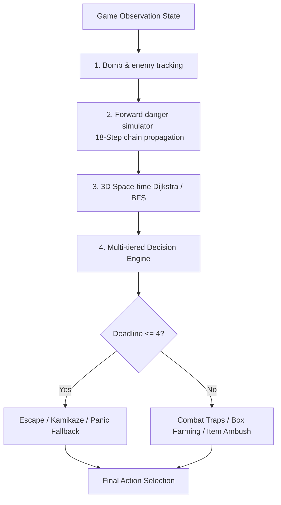

# TalonAgent

A highly sophisticated, rule-based autonomous agent that achieved a **TOP 5** ranking in the autonomous A.I challenge for GDGoC AI Challenge 2026.

`Talon` is designed for real-time grid-based multi-agent environments resembling Bomberman, where it handles high-tempo resource gathering and combat navigation.

---

## Architecture overview

TalonAgent uses a modular, real-time control system that prioritizes dynamic threat evaluation and safe long-range search:

---

## Core methods & systems

### 1. Forward danger simulator
Instead of treating hazards statically, TalonAgent implements a dynamic **18-step forward lookahead simulator** (`_simulate_accurate_bombs_and_danger`):
*   **Recursive chain detonations**: Models bomb countdowns and real-time chain reactions. If a blast hits another ticking bomb, that bomb's timer is recursively updated to detonate immediately.
*   **Destruction-aware obstacles**: Grid boxes block blasts but are destroyed. The simulator tracks the precise step a box collapses, allowing explosions in subsequent steps to correctly propagate through the newly opened pathway.
*   **Danger deadlines**: Compiles the simulation into a space-time hazard grid mapping coordinate safety deadlines.

### 2. 4D Space-time pathfinding
Standard 2D search is replaced with a **3D Space-time Dijkstra/BFS engine** (`_find_safe_path`):
*   **Dynamic collision checking**: Verifies coordinate safety at the exact future step the agent intends to step on it.
*   **Permanent safety verification**: The pathfinder only approves moves if it can prove a valid, uninterrupted survival path exists past the maximum active bomb timer. This prevents the agent from walking into dead ends.
*   **Weighted heuristics**: Cost evaluation penalizes narrow dead-ends, board edges, and enemy blast lanes, while heavily rewarding powerup collections and proximity to target boxes.

### 3. Multi-tiered decision engine
The main control loop evaluates a prioritized action matrix. It triggers the first safe match:
1.  **Crisis management (Escape mode)**: Tight deadlines trigger safety routes, falling back to **Kamikaze mode** (placing resource-denial bombs) or **Panic fallback** (maximizing survival ticks).
2.  **High-value finisher**: Places bombs if it guarantees a kill or isolates the enemy to $\le 1$ exit.
3.  **Close combat overload**: Places consecutive bombs to pressure or corner adjacent enemies.
4.  **Coordinated double/triple traps**: Spans sequential bombs 2-3 cells apart to block entire corridors and trap opponents.
5.  **Ambush & interception**: bait bombs placed at item spawn spots to intercept enemies, forcing them to retreat while we collect the item.
6.  **Box farming & chain-bombing**: Optimizes box destruction by calculating hotspots and centroids. When moving away from a bomb, the agent instantly heads to the next farming spot without idle waiting.

### 4. Game-state adaptation
*   **Dynamic phase shifting**: Shifts focus from box farming to active PvP combat once box counts drop below thresholds (25% for PvP, 15% for Endgame).
*   **Enemy motion tracking**: Tracks enemy velocity vectors over consecutive frames to predict their position 3 ticks ahead.
*   **Defensive shifting**: Evaluates the safest defensive coordinates to hold lanes and keep distance when leading.
